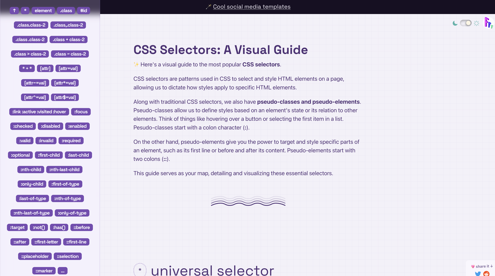

[https://fffuel.co/css-selectors/](https://fffuel.co/css-selectors/)

오오!!! CSS 셀렉터를 비주얼로 알려주는 사이트를 알게 되었습니다.

선택된 모습이 옆에 나와서 알기 쉽게 되었는데요.
그 중 새로 알게된 셀렉터도 있습니다. 

자주 사용하는 것만 사용하다보니...

## [attr^=val]
**val** 시작하는 값을 가진 지정된 속성이 있는 요소를 선택합니다.

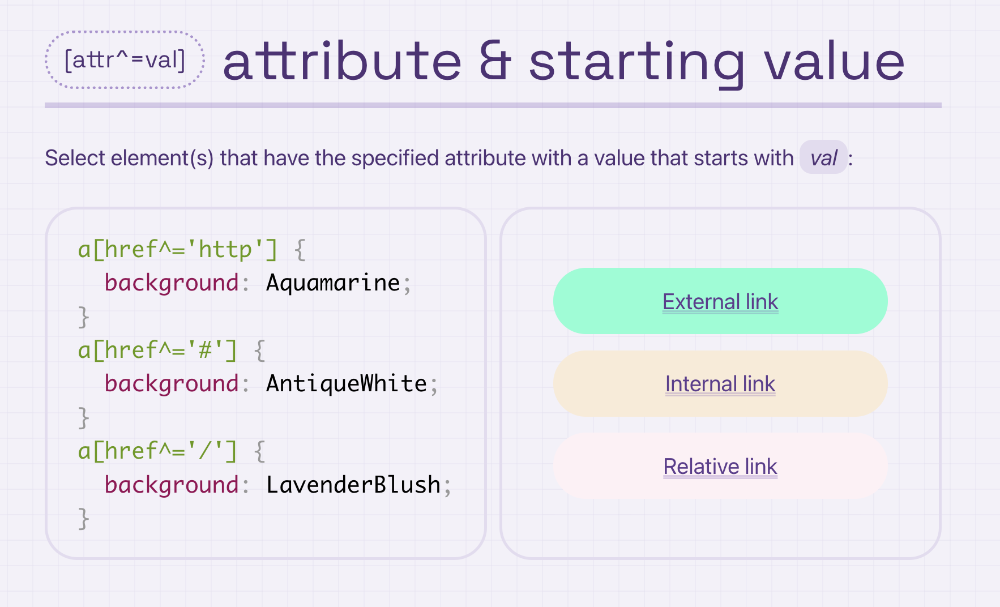

## [attr$=val]
**val** 끝나는 값을 가진 지정된 속성이 있는 요소를 선택합니다.

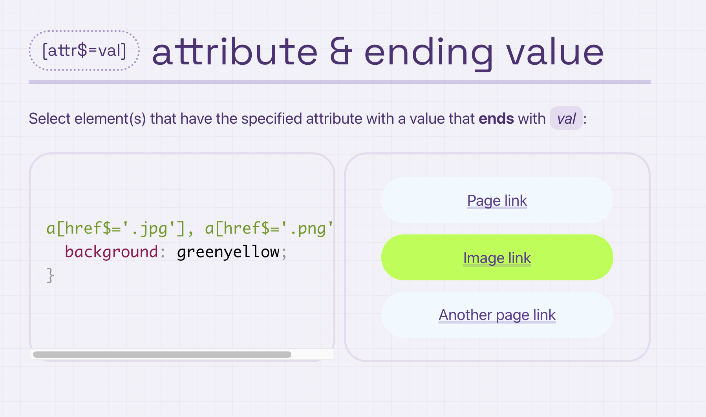

## :valid
:valid 가상 클래스는 속성(예: pattern , type 등)에 의해 지정된 요구 사항과 일치하는 콘텐츠가 있는 입력 요소를 대상으로 하는 데 사용됩니다.

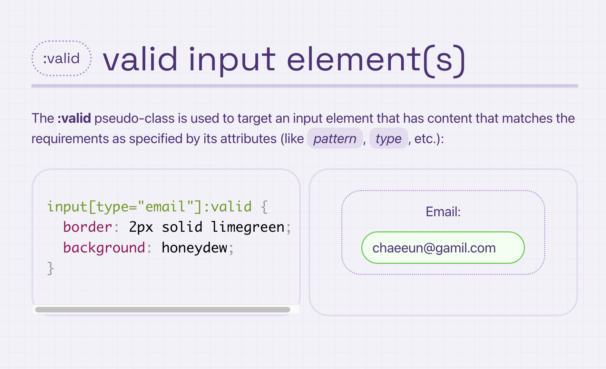

## :optional
:optional 가상 클래스는 필수 속성 이 없는 입력 요소를 대상.

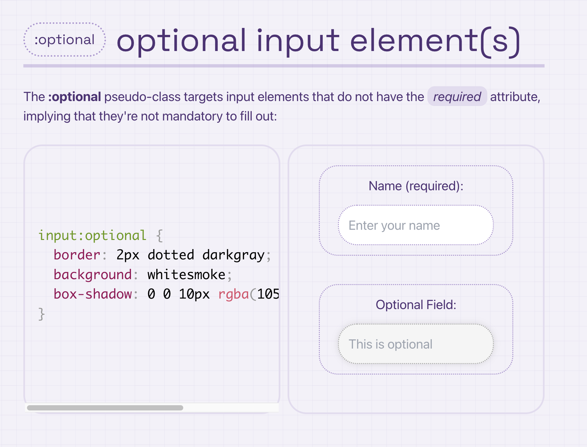

## :nth-last-child
: nth-last-child 의사 클래스는 :nth-child와 유사하지만 마지막 자식부터 거꾸로 계산합니다.

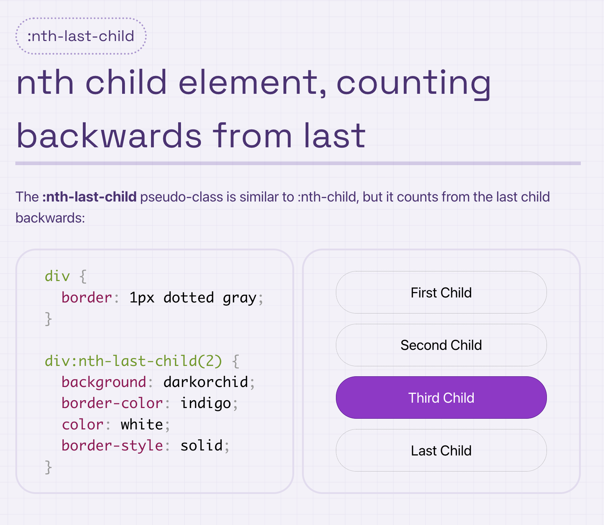

## :only-child
: only-child는 부모의 유일한 자식 요소인 경우 요소를 대상으로 합니다.

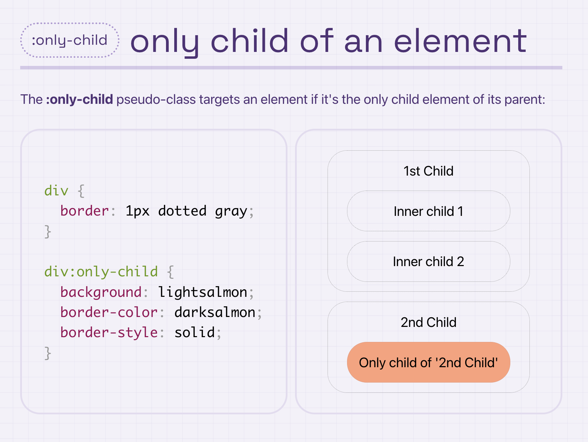

## :target
:target 가상 클래스는 URL 조각과 일치하는 ID 속성이 있는 요소를 선택합니다.
(예: https://example.com/#fragment)
:target은 직접 연결된 페이지 섹션의 스타일을 지정하는 데 자주 사용되며 일반적으로 인페이지 링크와 함께 사용됩니다.

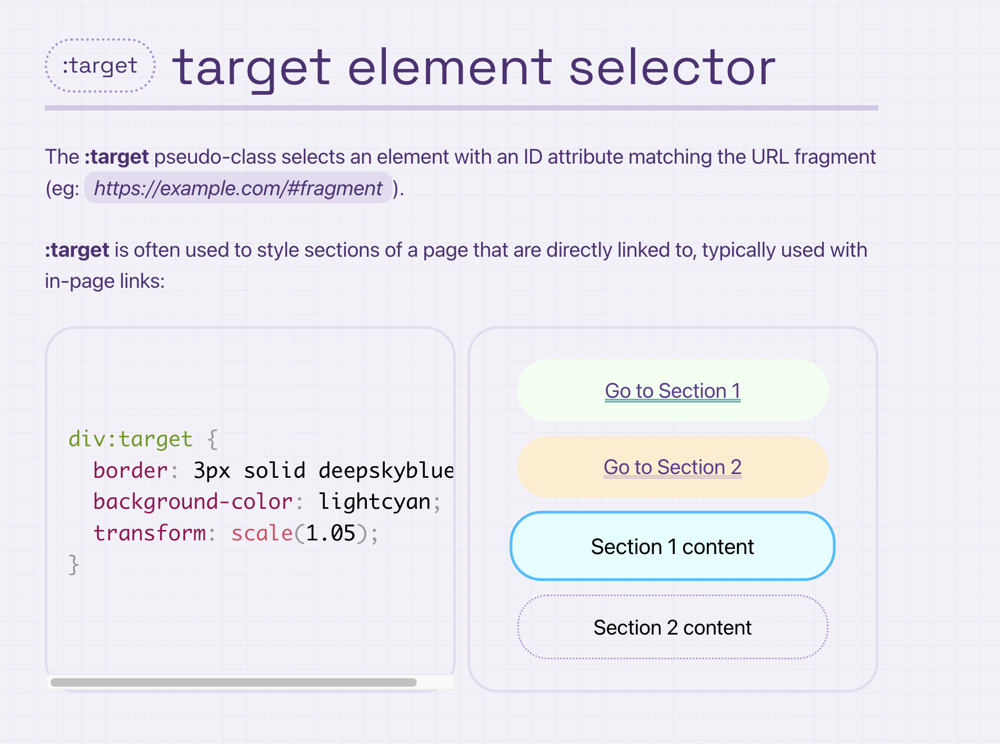

## ::first-letter
:: first-letter 가상 요소는 블록 수준 요소의 첫 번째 문자 스타일을 지정.

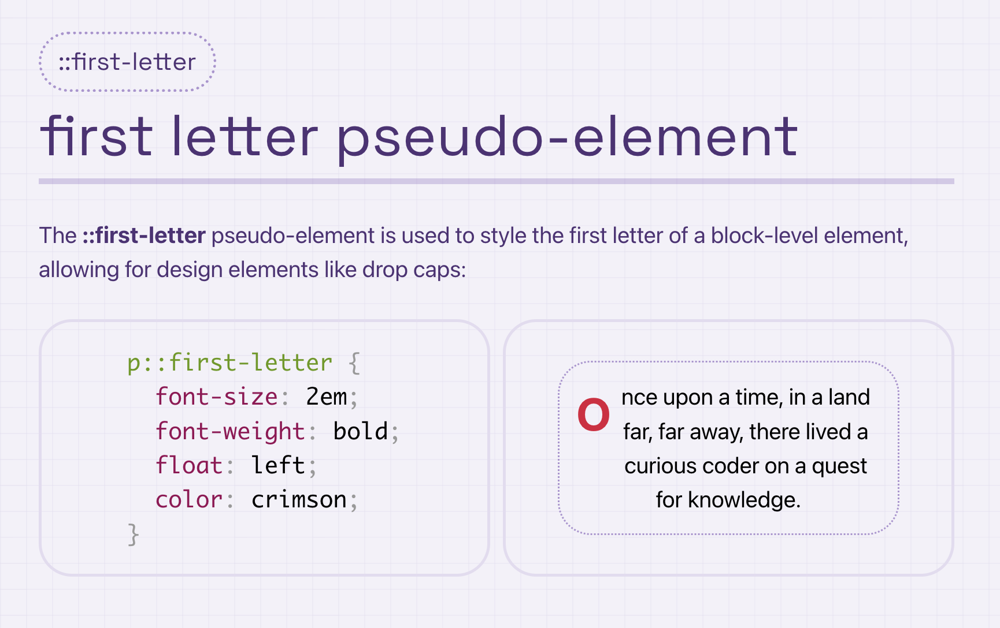

## ::first-line

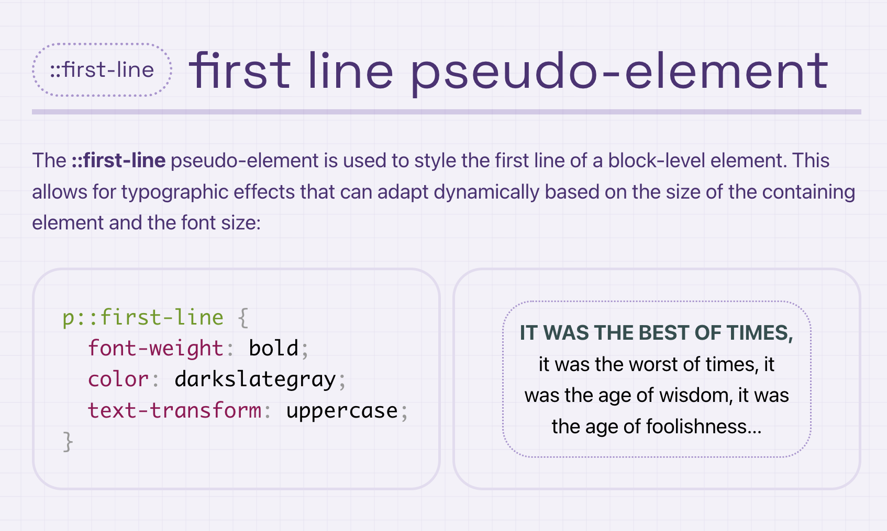

## ::marker
:: marker 가상 요소는 일반적으로 글머리 기호(정렬되지 않은 목록의 경우) 또는 숫자/문자(정렬된 목록의 경우)를 포함하는 목록 항목의 마커 상자 스타일을 지정하는 데 사용됩니다.

::marker를 도입하기 전에 이러한 마커를 사용자 지정하려면 종종 해결 방법이 필요했지만 이 의사 요소는 우리에게 좀 더 많은 제어 기능을 제공합니다.

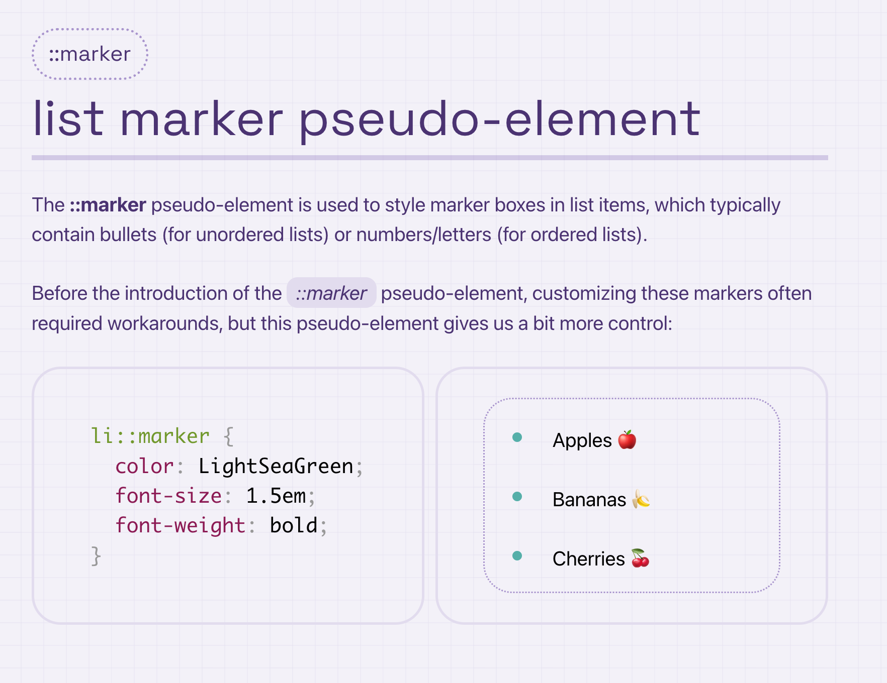

## more

- :where() : 선택자의 특이성에 영향을 주지 않고 조건에 따라 요소를 선택할 수 있습니다. 
- :default : 기본 선택 상태로 설정된 UI 요소(라디오 버튼 또는 체크박스 등)와 일치합니다. 
- :empty : 자식이 없는 요소를 선택합니다(텍스트 노드 포함). 
- :fullscreen : 현재 전체 화면 모드로 표시되는 요소를 대상으로 합니다. 
- :in-range : 지정된 범위 내에 있는 값과 양식 요소를 일치시킵니다( min 및 max 와 같은 속성 사용 ). 
- :out-of-range : 지정된 범위를 벗어난 값을 가진 양식 요소를 찾습니다. 
- :indeterminate : 선택 되거나 선택되지 않은 확인란과 같이 상태가 불확실한 양식 요소를 대상으로 합니다(종종 트리 뷰 구조에서 볼 수 있음). 
- :lang() : 언어 속성을 기반으로 요소를 찾습니다. 예: :lang(en)은 영어로 정의된 요소를 선택합니다. 

## :, :: 차이점

:: CSS3 문법으로 가상클래스와 가상요소를 구분하기 위해서 나왔습니다.
: CSS2, :: CSS3
가상클래스 예
> :hover, :active, :checked, ...
가상요소 
> ::after, ::before, ::placeholder, ..
호환성을 위해 :after, :before도 가능합니다.