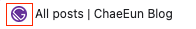
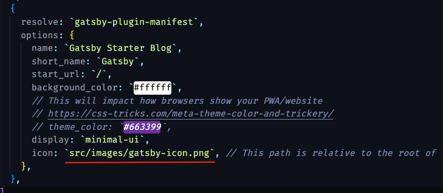
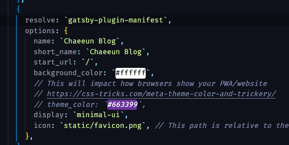

이제 블로그를 만들었는데 기본 파비콘이 맘에 들지 않습니다.

## gatsby.config.js 변경하기



icon부분을 수정해주면 됩니다. 



저는 static 폴더 안에 favicon.png이란 파일을 추가하고 변경했습니다.
하지만 수정을 해도 아직 변경이 안되었습니다!

```shell
npm run build
```
public/icon 폴더를 보면 파일이 변경되었습니다!


