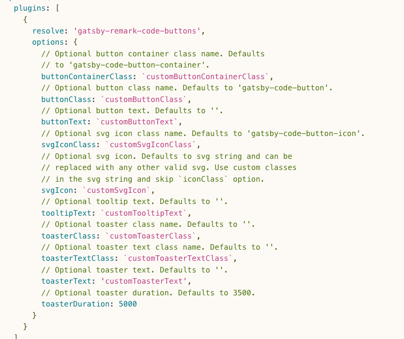

gatsby  plugin을 이용해서 코드블럭을 이쁘게 바꿔보자.

[gatsby-remark-highlight-code](https://www.gatsbyjs.com/plugins/gatsby-remark-highlight-code/)사용했습니다.
gatsby plugin 사이트에서 다른 syntax highlight 플러그인 검색해 볼 수 있습니다!

## 설치하기
```shell
npm install --save gatsby-transformer-remark gatsby-remark-highlight-code @deckdeckgo/highlight-code
```

## gatsby-config.js 정보 추가하기
```javascript:title=gatsby-config.js
// In your gatsby-config.js
plugins: [
  {
    resolve: `gatsby-transformer-remark`,
    options: {
      plugins: [
        {
          resolve: `gatsby-remark-highlight-code`,
        },
      ],
    },
  },
];
```

## index.js import 하기

```javascript:title=index.js
import { defineCustomElements as deckDeckGoHighlightElement } from "@deckdeckgo/highlight-code/dist/loader";
deckDeckGoHighlightElement();
```

다음 옵션들을 제공해줍니다.
저는 lineNumbers 을 활성화합니다.

|propterty|type|default|
|---|---|---|
|terminal| carbon, ubuntu or none|carbon|
|theme	| theme	3024-night , a11y-dark , blackboard , base16-dark , base16-light , cobalt , dracula , duotone , hopscotch , lucario , material , monokai , night-owl , nord , oceanic-next , one-light , one-dark , panda , paraiso , seti , shades-of-purple , solarized-dark , solarized-light , synthwave , twilight , verminal , vscode , yeti , zenburn|dracula|
|editable | boolean|false|
|lineNumbers | boolean|false|


```javascript:title=gatsby-config.js
// In your gatsby-config.js
plugins: [
  {
    resolve: `gatsby-transformer-remark`,
    options: {
      plugins: [
        {
          resolve: `gatsby-remark-highlight-code`,
          options: {
            lineNumbers: true,
          },
        },
      ],
    },
  },
];
```

## copy 버튼 추가하기
[gatsby-remark-code-buttons](https://www.gatsbyjs.com/plugins/gatsby-remark-code-buttons/)

### 설치하기

```shell
npm install gatsby-remark-code-buttons --save-dev
```

### gatsby-config.js 추가

```javascript:title=gatsby-config.js
plugins: [
  {
    resolve: 'gatsby-transformer-remark',
    options: {
      plugins: ['gatsby-remark-code-buttons']
    }
  }
]
```


다양한 옵션들이 있습니다.

```javascript:title=gatsby-config.js
 {
      resolve: `gatsby-transformer-remark`,
      options: {
        plugins: [
          {
            resolve: 'gatsby-remark-code-buttons',
            options: {
              svgIcon: ` `,
              buttonText: `COPY`,
              toasterText: '복사되었습니다 👏',
              // Optional toaster duration. Defaults to 3500.
              toasterDuration: 5000
            }
          },
```


그 중 저는 **svgIcon** 공란으로 두어 기본 아이콘을 없애고
COPY 라는  **buttonText** 속성을 통해 설정했습니다.

### 스타일 적용하기

```css:title=style.css
.gatsby-code-button {
  position: absolute;
  top: 0rem;
  margin-right: 0.8rem;
  font-size: 0.95rem;
}
.gatsby-code-button-toaster-text {
  font-size: 1.1rem;
  width: auto;
  padding: 1.7rem;
  border-radius: 0.8rem;
  background: #f0f0f0;
  color: #222;
  font-weight: 600;
  box-shadow: rgba(79, 255, 4, 0.45) 0 4px 15px;
}
```

## 파일명 표시하기

[gatsby-remark-code-titles](https://www.gatsbyjs.com/plugins/@pastelsky/gatsby-remark-code-titles/)

### 설치하기

```shell
npm install gatsby-remark-code-titles --save-dev
```

### gatsby-config.js 추가

``` javascript:title=gatsby-config.js
plugins: [
  {
    resolve: 'gatsby-transformer-remark',
    options: {
      plugins: [
        {
          resolve: 'gatsby-remark-code-titles',
          options: {
            className: 'your-custom-class-name'
          }
        } // IMPORTANT: this must be ahead of other plugins that use code blocks
      ]
    }
  }
]
```

### 스타일 적용하기

```css:title=style.css
.gatsby-remark-code-title {
  position: absolute;
  left: 50%;
  width: 50vw;
  max-width: 350px;
  padding: 0.2em 10px;
  background-color: #22222b;
  color: white;
  z-index: 0;
  font-size: 0.9rem;
  font-weight: 500;
  text-align: center;
  border-radius: 10rem;
  transform: translate(-50%, 1.6rem);
}
```
