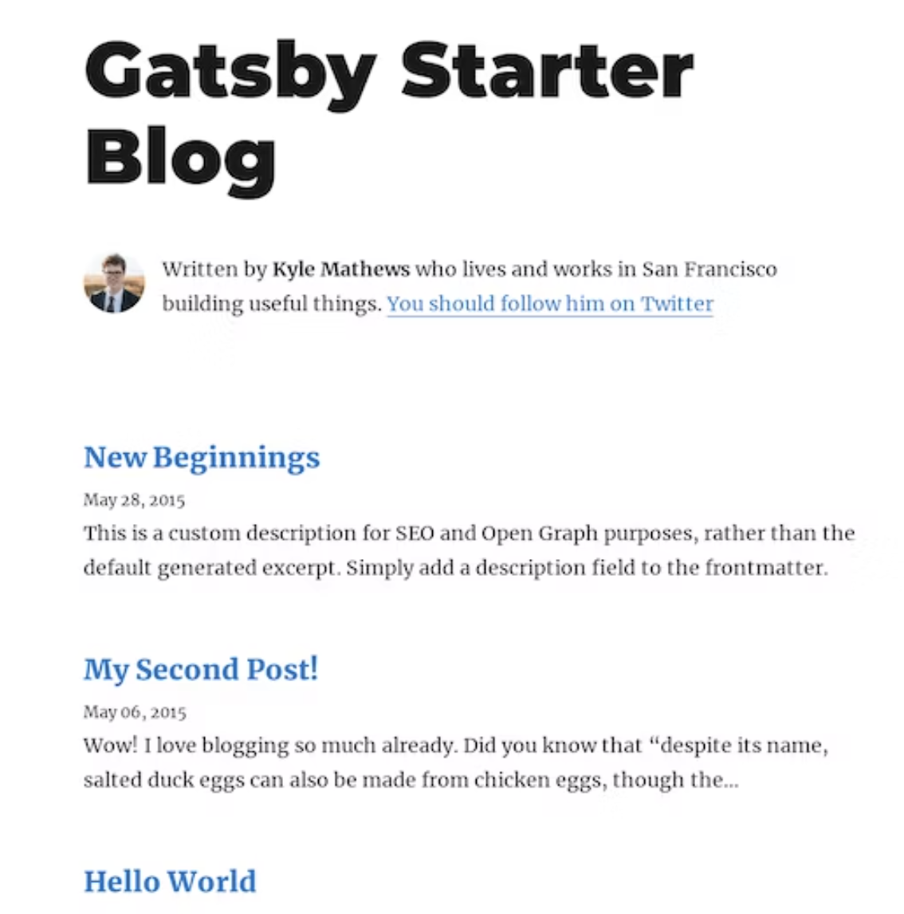
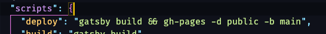

드디어 첫 블로그를 생성하게 되었습니다! 
작업하거나 배운 것들을 기록해야겠다는 필요성을 자꾸 느끼게 되었습니다.
나만의 블로그를 만들어보자는 생각에 Gatsby로 이용해서 만들게 되었습니다!

## Gatsby 설치

Gatsby를 사용하기 위해 Gatsby CLI 설치합니다.

```shell
npm install -g gatsby-cli
```
gatsby 버전을 확인합니다.

```shell
gatsby --version
```

## 프로젝트 생성

Gatsby 블로그 스타터를 이용해서 프로젝트를 생성하겠습니다. 
저는 [gatsby-starter-blog](https://www.gatsbyjs.com/starters/gatsbyjs/gatsby-starter-blog/)이용해서 만들겠습니다.

다음 링크에서 다른 테마를 더 확인해볼 수 있습니다.
[스타터테마모음](https://www.gatsbyjs.com/starters/)

```shell
gatsby new "프로젝트명" "스타터 테마 주소"
```

```shell
gatsby new gatsby-starter-blog https://github.com/gatsbyjs/gatsby-starter-blog
```

```shell
cd gatsby-starter-blog
```

```shell
yarn develop or gatsby develop
```

[http://localhost:8000/](http://localhost:8000/)



구축된 블로그가 나옵니다!

## github-page로 배포하기

### gh-pages 설치

```shell
npm install gh-pages --save-dev
```

### package.json 추가하기


```json
{
  ...
  "scripts": {
    "deploy": "gatsby build && gh-pages -d public -b main",
  }  
}
```

### github 레파지토리를 생성합니다
블로그 주소를 [아이디].github.io로 생성하려며 레파지토리 이름을 [아이디].github.io으로 설정합니다.
이름을 설정하고 public으로 설정합니다.
**Create repository**를 클릭합니다.

```shell
git init
git branch -M main
git add .
git commit -m "first commit"
git remote add origin https://github.com/[아이디]/[아이디].github.io.git
git push -u origin main
```
git 레파지토리에 소스가 올라갔습니다!

### 배포하기

```shell
npm run deploy
```

이제 블로그 페이지가 배포되었습니다!

### dev 브랜치에 소스 올리기

main 브랜치에는 컴파일된 파일들이 올라 갔습니다. 
dev라는 브랜치를 만들어서 소스파일을 올려줍니다!

```shell
git branch dev // dev 브랜치 생성
git checkout dev
...
git push -u origin dev
```


